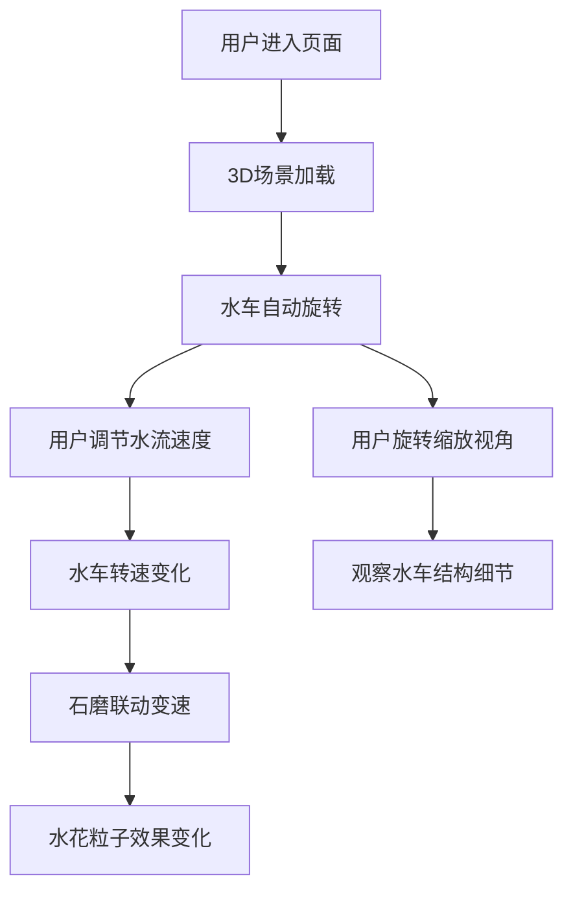

## 1. 产品概述

3D水车磨坊交互场景，展示乡间溪流边的老水车在水流推动下缓缓转动的自然景观。用户可以调节水流速度，观察水车和石磨的联动效果，通过旋转缩放镜头探索水车结构和水花细节。

- 目标用户：对3D交互场景、自然景观展示感兴趣的用户
- 产品价值：提供沉浸式的3D交互体验，展示水车磨坊的工作原理和自然美学

## 2. 核心功能

### 2.1 用户角色
| 角色 | 注册方式 | 核心权限 |
|------|----------|----------|
| 访客用户 | 无需注册 | 浏览3D场景、调节水流速度、旋转缩放视角 |

### 2.2 功能模块
1. **3D场景展示**：水车模型、磨坊建筑、溪流环境、水花粒子效果
2. **动画系统**：水车旋转、石磨联动、水流流动、水花粒子
3. **交互控制**：水流速度调节、镜头旋转缩放、视角切换
4. **UI控制面板**：速度滑块、信息提示

### 2.3 页面详情
| 页面名称 | 模块名称 | 功能描述 |
|----------|----------|----------|
| 主场景页 | 3D水车磨坊场景 | 全景展示水车磨坊，支持旋转缩放观察 |
| 主场景页 | 控制面板 | 水流速度调节滑块，实时影响水车转速 |
| 主场景页 | 信息提示 | 场景说明和操作指引 |

## 3. 核心流程

用户进入页面 → 3D场景加载完成 → 水车自动开始缓慢转动 → 用户调节水流速度 → 水车转速随水流变化 → 用户旋转缩放视角观察细节 → 水花粒子效果随速度变化

## 4. 用户界面设计

### 4.1 设计风格
- **主色调**：自然绿色系（溪流、草木）+ 木色（水车、磨坊）+ 蓝色（水流）
- **视觉风格**：写实风格的3D渲染，自然清新的乡间氛围
- **控制面板**：半透明磨砂玻璃效果，简约现代的UI设计
- **字体**：中文使用思源宋体，英文使用优雅的衬线字体
- **动效**：平滑过渡、自然缓动

### 4.2 页面设计概述
| 页面名称 | 模块名称 | UI元素 |
|----------|----------|--------|
| 主场景页 | 3D场景 | 全屏幕3D渲染，水车、磨坊、溪流、树木 |
| 主场景页 | 控制面板 | 右下角悬浮面板，水流速度滑块、重置视角按钮 |
| 主场景页 | 标题区域 | 左上角场景标题和简介 |

### 4.3 响应式
- Desktop-first设计，全屏3D场景
- 控制面板在移动端自动调整大小和位置
- 支持触摸手势旋转缩放

### 4.4 3D场景指引
- **环境**：乡间溪流环境，天空、草地、树木、石头
- **光照**：自然日光，柔和阴影，营造温暖的午后氛围
- **相机**：默认远景视角，支持OrbitControls旋转缩放
- **构图**：水车位于画面中心偏左，磨坊在右侧，溪流从画面深处流向近处
- **交互**：鼠标拖拽旋转，滚轮缩放，点击聚焦
- **后处理**：轻微泛光、环境光遮蔽，提升画面质感
- **性能**：控制粒子数量，保持60fps流畅运行
