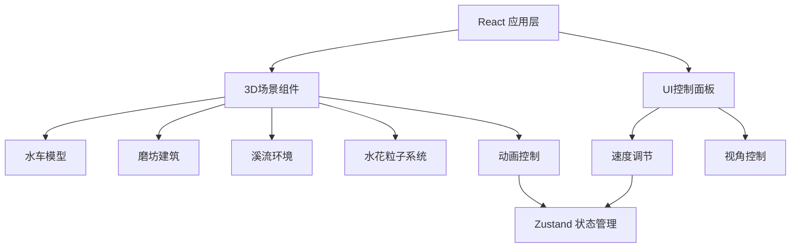

## 1. 架构设计



## 2. 技术描述

- **前端框架**：React@18 + TypeScript
- **构建工具**：Vite@5
- **样式方案**：TailwindCSS@3
- **3D渲染**：Three.js + @react-three/fiber + @react-three/drei
- **状态管理**：Zustand
- **后处理**：@react-three/postprocessing
- **图标库**：lucide-react

## 3. 路由定义

| 路由 | 用途 |
|------|------|
| / | 主场景页面，3D水车磨坊交互展示 |

## 4. 项目结构

```
src/
├── components/
│   ├── WaterWheel/        # 水车组件
│   ├── Mill/              # 磨坊组件
│   ├── Stream/            # 溪流环境
│   ├── SplashParticles/   # 水花粒子
│   ├── ControlPanel/      # 控制面板
│   └── SceneLighting/     # 场景光照
├── hooks/
│   └── useAnimation.ts    # 动画控制hook
├── store/
│   └── useSceneStore.ts   # 场景状态管理
├── pages/
│   └── Home.tsx           # 主页
├── App.tsx
├── main.tsx
└── index.css
```

## 5. 核心技术点

### 5.1 3D模型构建
- 水车：使用Three.js原生几何体组合构建（轮轴、辐条、叶片）
- 磨坊：木质结构建筑，包含石磨
- 环境：地形、溪流、树木、石头

### 5.2 动画系统
- 水车旋转：基于水流速度的旋转动画
- 石磨联动：与水车转速成比例的旋转
- 水流效果：纹理滚动 + 顶点动画
- 水花粒子：叶片入水时触发粒子效果

### 5.3 交互控制
- OrbitControls：鼠标拖拽旋转、滚轮缩放
- 速度滑块：调节水流速度，影响水车转速
- 视角重置：一键恢复默认视角

### 5.4 性能优化
- 粒子数量动态控制
- 几何体实例化
- 合理的LOD策略
